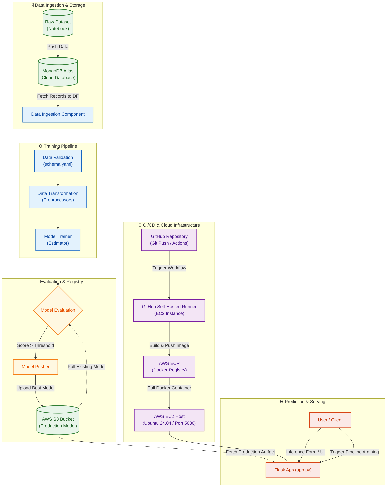

# Vehicle Insurance | End-to-End MLOps Pipeline

## 📌 Project Overview

An end-to-end **Machine Learning and MLOps pipeline** for predicting whether an existing vehicle-insurance customer is likely to be interested in purchasing vehicle insurance.

The project combines a **Random Forest classification model** with a complete MLOps workflow covering data storage, ingestion, validation, transformation, model evaluation, artifact management, containerization, CI/CD, cloud infrastructure, and model serving.

The ML model is developed using **Scikit-learn**, while the deployment and infrastructure layer is built using **MongoDB Atlas, Docker, AWS, GitHub Actions, and Flask**.

---

## 🛠️ Tech Stack

| Category                     | Technology                        | Purpose                                    |
| ---------------------------- | --------------------------------- | ------------------------------------------ |
| 🐍 **Programming**           | Python                            | Core application and ML development        |
| 🤖 **Machine Learning**      | Scikit-learn                      | Model development and preprocessing        |
| 🌲 **ML Model**              | Random Forest                     | Binary classification                      |
| 🎯 **Hyperparameter Tuning** | RandomizedSearchCV                | Model parameter optimization               |
| 🗄️ **Database**             | MongoDB Atlas                     | Cloud-based dataset storage                |
| 🐳 **Containerization**      | Docker                            | Package application and dependencies       |
| ☁️ **Cloud Storage**         | Amazon S3                         | Store production model artifacts           |
| 📦 **Container Registry**    | Amazon ECR                        | Store Docker images                        |
| 🖥️ **Cloud Compute**        | Amazon EC2                        | Host application and CI/CD runner          |
| 🔐 **Cloud Security**        | AWS IAM                           | Manage AWS access and permissions          |
| 🔄 **CI/CD**                 | GitHub Actions                    | Automate build and deployment              |
| 🖥️ **CI/CD Runner**         | Self-Hosted GitHub Actions Runner | Execute deployment workflow on EC2         |
| 🌐 **Web Framework**         | Flask                             | Model serving and prediction application   |
| 📊 **Data Processing**       | Pandas, NumPy                     | Data manipulation and numerical processing |

---

# 🏗️ Project Architecture

The project is divided into two connected layers:

* **Machine Learning Pipeline** — handles the movement of data from ingestion through model training and evaluation.
* **MLOps & Deployment Pipeline** — handles model artifact storage, containerization, CI/CD, cloud infrastructure, deployment, and serving.

### 🤖 Machine Learning Flow

The ML pipeline handles the movement of data from the database to the trained model:

**MongoDB Atlas → Data Ingestion → Data Validation → Data Transformation → Model Training → Model Evaluation**

The ML workflow uses:

* **Data validation** using a defined schema
* **Categorical encoding**
* **Feature scaling**
* **Random Forest Classifier**
* **RandomizedSearchCV** for hyperparameter tuning
* **Model evaluation** against the defined evaluation criteria

The trained model is then passed to the MLOps layer for artifact management and deployment.

### ⚙️ MLOps & Deployment Flow

The MLOps layer manages the lifecycle of the trained model and application:

**Model Evaluation → Model Pusher → Amazon S3**

The production model is stored in **Amazon S3**, providing a persistent model artifact that can be accessed by the prediction application.

For application deployment:

**GitHub → GitHub Actions → Self-Hosted Runner → Docker → Amazon ECR → Amazon EC2**

GitHub Actions automates the deployment workflow. The application is packaged into a Docker image, pushed to Amazon ECR, and deployed on an EC2 instance.

The deployed **Flask application** retrieves the production model artifact from S3 and provides the prediction interface.

### ☁️ Cloud Architecture

AWS is used across different parts of the system based on their respective responsibilities:

* **S3** — production model artifact storage
* **ECR** — Docker image registry
* **EC2** — application hosting and self-hosted CI/CD runner
* **IAM** — AWS authentication and permissions

MongoDB Atlas is used separately as the **cloud data storage layer**, while AWS provides the infrastructure for **model management and application deployment**.
