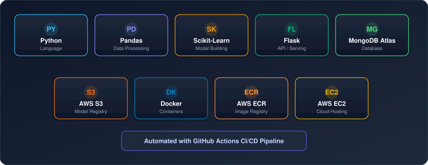
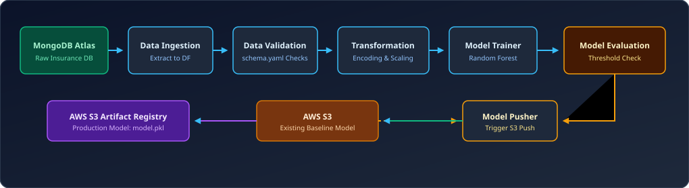
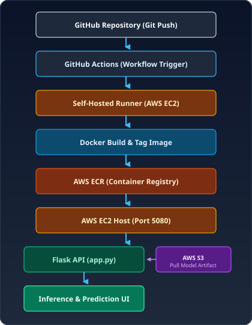

# Vehicle Insurance | End-to-End MLOps Pipeline

## Project Overview

The project aims to predict whether a **registered vehicle-insurance customer is likely to purchase vehicle insurance** based on their existing customer and policy information[cite: 1]. The application takes customer details as input and uses a **Random Forest classification model** to generate the prediction[cite: 1].

The project implements an end-to-end machine learning workflow for processing customer data, training and evaluating the model, with the trained model **integrated into a Flask API for serving predictions**[cite: 1].

The application follows a **modular architecture and MLOps workflow**, using **MongoDB Atlas** for data storage, **AWS S3** for model artifact storage, **AWS ECR** as the Docker container registry, and **AWS EC2** for application deployment[cite: 1]. **GitHub Actions** is used to automate the CI/CD pipeline[cite: 1].

---

## Tech Stack

  

| Technology     | Category             |
| -------------- | -------------------- |
| Python         | Programming Language |
| Pandas         | Data Processing      |
| Scikit-learn   | Machine Learning     |
| Flask          | API / Model Serving  |
| MongoDB Atlas  | Database             |
| AWS S3         | Cloud Storage        |
| Docker         | Containerization     |
| AWS ECR        | Container Registry   |
| AWS EC2        | Cloud Compute        |
| GitHub Actions | CI/CD                |

---

## Project Architecture

The project is divided into two main workflows: a **Model Training & Model Registry Pipeline** for training, evaluating, and managing production model artifacts, and a **CI/CD & Deployment Pipeline** for containerizing and deploying the application[cite: 1].

### 1. Model Training & Model Registry Pipeline

  

### Pipeline Flow

* **MongoDB Atlas** — Stores the dataset used by the training pipeline[cite: 1].
* **Data Ingestion** — Retrieves data from MongoDB Atlas for processing[cite: 1].
* **Data Validation** — Validates the incoming data against the defined schema[cite: 1].
* **Data Transformation** — Applies the required preprocessing and feature transformations[cite: 1].
* **Model Training** — Trains the machine learning model using the transformed data[cite: 1].
* **Model Evaluation** — Evaluates the newly trained model against the existing production model[cite: 1].
* **Model Pusher** — Pushes the newly trained model to S3 when it meets the defined evaluation threshold[cite: 1].
* **AWS S3** — Stores the production model artifact used by the deployed application[cite: 1].
* **Logging & Exception Handling** — Provides application logging and structured exception handling across the pipeline for tracking execution and errors[cite: 1].

AWS S3 acts as the bridge between the training and serving workflows[cite: 1]. The training pipeline compares the newly trained model with the existing production model[cite: 1]. When the new model meets the evaluation criteria, it is stored as the production artifact in S3[cite: 1]. The deployed Flask application retrieves this production model artifact for making predictions[cite: 1].

---

## Machine Learning Flow

The ML pipeline processes the data through the following stages:

* **Data Validation** — Validates the input data against the defined schema[cite: 1].
* **Categorical Encoding** — Converts categorical features into numerical representations.
* **Feature Scaling** — Scales numerical features for model training.
* **Random Forest Classifier** — Trains the classification model.
* **RandomizedSearchCV** — Performs hyperparameter tuning to identify suitable model parameters.
* **Model Evaluation** — Evaluates the trained model using classification metrics and the defined evaluation criteria[cite: 1].

---

### 2. CI/CD & Deployment Pipeline

<table>
  <tr>
    <td width="55%" valign="top">

### Pipeline Flow

* **GitHub Repository** — Stores the application source code and CI/CD workflow configuration[cite: 1].
* **GitHub Actions** — Triggers the automated CI/CD workflow when changes are pushed to the repository[cite: 1].
* **Self-Hosted Runner** — Executes the GitHub Actions workflow on the configured EC2 instance[cite: 1].
* **Docker Build** — Packages the application and its dependencies into a Docker image[cite: 1].
* **AWS ECR** — Stores the built Docker image[cite: 1].
* **AWS EC2** — Pulls and runs the Docker image to host the deployed application[cite: 1].
* **Flask API** — Serves the trained model and handles prediction requests[cite: 1].
* **AWS S3** — Provides the production model artifact used by the deployed application[cite: 1].

    </td>
    <td width="45%" align="center" valign="top">
      
    </td>
  </tr>
</table>

---
